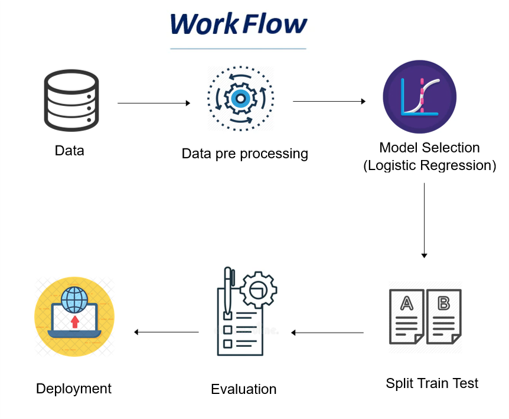
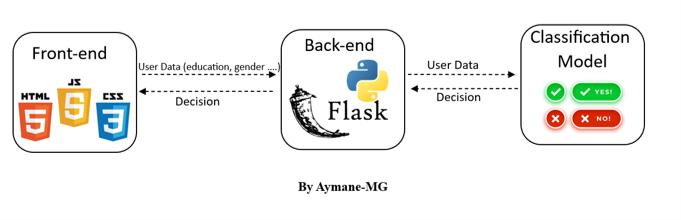

# Logistic-Regression-Club-Datai

## Loan credit estimation with logistic regression (classification task)

## WorkFlow
Here is the workflow :



## architecture

web app for credit estimation 




## Repository Structure

```batch
Logistic-Regression-Club-Datai:.
│   README.md
│
├───images
│       web_app.png
│       workflow.png
│
├───PROJECT
│   │   classifier.pkl
│   │   dataset.csv
│   │   label_encoders.pkl
│   │   Loan Credit.ipynb
│   │
│   └───Web_App_prediction
│       │   app.py
│       │   data_encoding.py
│       │
│       ├───models
│       │       classifier.pkl
│       │       label_encoders.pkl
│       │
│       ├───static
│       │   ├───css
│       │   │       b3.png
│       │   │       style2.css
│       │   │
│       │   └───js
│       │           script2.js
│       │
│       ├───templates
│                   index.html
│       
│
└───PPT
        Pre_RL.pdf

```


### Contacts
For any questions or further information, feel free to contact me :)

- **linkedin**: <a href="https://www.linkedin.com/in/aymane-maghouti/" target="_blank">Aymane Maghouti</a><br>
- **Email**: `aymanemaghouti@gmail.com`
